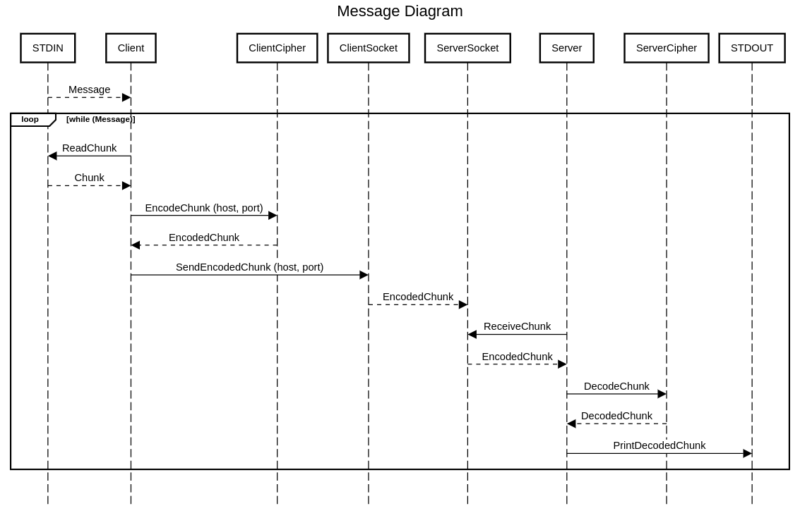
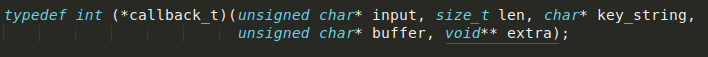

## **INFORME TP 1**

**Alumno:** Andrés Fernández

**Padrón:** 102220

**Link al repositorio:** https://github.com/andres912/Taller_TP1

### **DESCRIPCIÓN**

El siguiente diagrama muestra de forma muy general el funcionamiento del código:

Con un poco más de detalle, el funcionamiento del código es el siguiente:

* TDA Client / TDA Server:

    Son los TDAs que se encargan de llevar a cabo el envío y la recepción del mensaje de forma general. Ambos cuentan con los siguientes atributos:

        - TDA Cipher: para codificar/decodificar el mensaje.
        - TDA Socket: para enviar/recibir el mensaje. El Server tiene dos sockets, uno de conexión y otro de aceptación.
        - Buffer: el buffer utilizado para transportar cada chunk del mensaje desde que se lee de STDIN hasta que se escribe en STDOUT.

* Primero, el TDA Server establece a través de su TDA Socket la conexión necesaria para eventualmente recibir el mensaje. Si la conexión falla, el programa del Server se cierra. Esta paso no se incluyó en el diagrama porque el diagrama muestra otro tipo de secuencia, y agregar este paso lo volvía confuso.

* Si la conexión fue exitosa, el Server se quedará esperando a que el Client haga su conexión correspondiente.

* Por su lado, el TDA Client establecerá la conexión necesaria para el envío del mensaje. De no poder conectarse, el programa del Client se cierra. De lo contrario, se iniciará el ciclo de envío del mensaje. A partir de aquí, la secuencia contada seguirá el mismo esquema que el diagrama mostrado.

* El Cliente lee el mensaje de STDIN. Este mensaje es tomado como una cadena de bytes, y no como un string de caracteres (se transforma a unsigned char y no se usa strlen para conocer su largo). Este mensaje se lee de forma cíclica, en trozos de 64 bytes. El fin del ciclo se da cuando la función **feof** devuelve verdadero. La función **fread** marca la cantidad de bytes leídos, que puede ser como máximo 64. Esta cantidad de bytes leídos se utiliza a lo largo del ciclo de envío del mensaje.

* El Cliente envía el trozo del mensaje leído al TDA Cipher que tiene instanciado, que se encargará de codificarlo de acuerdo a los argumentos recibidos por parámetro.

* TDA Cipher:

	Es el TDA que se encarga de codificar o decodificar un mensaje, según se lo crea. Tiene los siguientes atributos:

	    - callback_t decoding_function: puntero a función de encriptación (más detalle abajo)
	    - int op_type: 0 si el cipher es de codificación, 1 si es de decodificación.
    	- char* key_string: clave de encriptación a utilizar en ambas operaciones.
    	- size_t type: tipo de decodificación (Cesar, Vigenere o RC4).
    	- size_t count: valor de la última posición que se leyó dentro de la totalidad del mensaje.
    	- unsigned char rc4_array[256]: arreglo que se utiliza en la encriptación por RC4.
    	- size_t rc4_pos2: valor adicional que se necesita en la encriptación por RC4.

    Los últimos 3 valores del Cipher son necesarios para guardar el "estado" del mensaje que se está encriptando. Una de las dificultades del TP es que tanto Vigenere como RC4 son métodos que contemplan la encriptación de un mensaje total, por lo que, al leer el mensaje de a 64 Bytes, es necesario entre lecturas guardar el estado de algunas variables que permitan llevar a cabo la encriptación de forma correcta. Cesar no presentó esta dificultad, porque su encriptación no depende de la posición actual del mensaje.

* **callback_t decoding_function**: es un puntero a la función de encriptación. Funciona para los 3 tipos de encriptación: Cesar, Vigenere y RC4. Si bien las tres funciones comparten sólo algunos parámetros de encriptación, los parámetros en los que difieren son pasados a través de un vector de punteros genéricos, el cual es armado por el cipher de acuerdo a cada función, y desreferenciado dentro de cada una de éstas.

. En la función **Cesar**, el vector recibe la clave de decodificación (como string) y el tipo de operación: codificar o decodificar.

. En la función **Vigenere**, recibe la clave de decodificación, el tipo de operación y la posición actual en el mensaje.

. En la función **RC4**, recibe la posición actual en el mensaje (pos_1 en rc4_output), el vector random que usa la función ya inicializado y la pos_2 en rc4_output.

* El cipher codifica el trozo de 64 Bytes del mensaje en un buffer correspondiente al Cliente. El Cliente le indica a su Socket que reenvíe este buffer al socket servidor. El envío del mensaje se hace mediante un ciclo, ya que no necesariamente los 64 Bytes (o el largo del trozo de mensaje) son enviados en una única operación.

* TDA Socket:

	Es el TDA que se encarga de conectarse a los sockets "reales" (los provistos por la librería correspondiente) y de enviar y/o recibir un mensaje a/desde otro socket. Tiene los siguientes atributos:

		- struct addrinfo* addr_info: es una estructura propia de la librería de sockets, necesaria para la conexión entre los mismos.
    	- int connection_socket_fd: guarda el fd correspondiente al socket de conexión (en el caso del socket cliente, es el único socket necesario).
    	- int acceptance_socket_fd: guarda el fd correspondiente al socket de aceptación, que es el que termina recibiendo el mensaje (sólo necesario para el servidor).

    En un primer momento, había hecho dos tipos de socket distintos: un TDA transmissionSocket y otro TDA receptorSocket, cada uno con sus propios métodos y alguna diferencia en su estructura (el transmissionSocket no tenía acceptance_socket_fd). Sin embargo, como en clase se hizo hincapié a que ambos sockets pueden enviar y recibir información, me pareció más correcto terminar haciendo un único TDA socket que agrupara a todos los métodos.

* El socket servidor recibe el mensaje del socket cliente. Al igual que en el envío, la recepción del total de los bytes se realiza en un ciclo. A diferencia de la operación de envío, en la recepción no se conoce la cantidad de bytes a recibir del cliente, por lo que el ciclo se corta cuando en una de las operaciones se recibieron 0 bytes.

* El trozo de mensaje se envía a un nuevo cipher, que esta vez se encargará de decodificarlo. Para Cesar y Vigenere, se realizará la operación matemática inversa a la realizada durante la codificación. Para RC4, la operación será exactamente la misma que en su codificación.

* Se envía el trozo de mensaje para ser impreso por salida estándar, y se vuelve a iniciar el ciclo. Recién en este momento, se vuelve a tomar la cadena de bytes como un string, por lo que se hace un printf con "%c" como formato.

### **COMENTARIOS**

* Además de las dificultades mencionadas, también surgió una a la hora de enviar y recibir el mensaje entre los sockets. Tardé bastante en darme cuenta de ir actualizando la posición inicial del envío del buffer en cada **send** y en cada **receive**. Es decir, si en la primera operación de envío se enviaron n bytes, en la próxima operación el envío del mensaje debía comenzar desde la posición buffer[n], y la cantidad de bytes a enviar debería ser de k-n bytes (con k el largo del trozo de mensaje). De forma análoga debía hacerse con la recepción del mensaje.

* Intenté usar el heap lo menos posible, pero en algunos casos tuve que decidir entre el uso del heap y un código más prolijo. Por ejemplo, pude hacer un único tipo callback_t para las funciones de decodificación, pero para eso fue necesario un vector de punteros genéricos para cuya utilización tuve que usar malloc.

* En un primer momento, había intentado leer el stdin de a 64 bytes, pero pasando todo a un buffer que contuviera la totalidad del mensaje. A partir de ahí, sólo se tenía un buffer a codificar y enviar al servidor. El problema es que eso implicaba poner un límite a la cantidad de bytes que podía contener el mensaje, porque el buffer estaba en memoria estática y necesitaba darle un tamaño antes de leer stdin. Cuando entendí mejor lo que se pedía en el enunciado, tuve que cambiar el funcionamiento del código.

